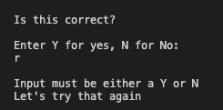

# Welcome to Burger Party
## Overview

**Burger Party** is a catering company providing Burgers, Fries and Drinks to parties.  

# The App

They want an app made where guests at the party can choose the food and drink they would like and a record made of the order, so they can prepare it for collection.  This benefits the customer as they can make an order through the app and not have to physically queue.  This also benefits the company by taking the pressure off of having a physical queue in front of them and allowing them to prepare the order in a more relaxed manner.

## What the App does

 1. Welcomes the user 
 2. Displays the choice of burgers (from the burgers sheet)
 3. Asks the user to choose a burger type
 4. The choice is validated to be a correct choice
 5. Asks the user to confirm their choice of burger
 6. Displays the choice of fries (from the fries sheet)
 7. Asks the user to choose a type of fries
 8. Asks the user to confirm their choice of fries
 9. Displays the choice of drinks (from the drinks sheet)
 10. Asks the user to choose a drink type
 11.  Asks the user to confirm their choice of drink
 12. Asks the user if they would like to to add whisky to their drink
 13. If they want whisky they are asked for their date of birth
 14. If they are under 18 they are informed they are too young
 15. The order is confirmed to the user
 16. The order is added to the order worksheet

# Testing

The main areas for testing have been carried out manually and evidenced in the images below:

 1. The user is welcomed
<p></p>
	
2. The choice of burgers are displayed
<p></p>

 These are taken from the Burgers sheet
<p></p>
 
 3. The user is asked to choose a burger type
 <p></p>

4. If the user choice is not a valid choice the user is prompted to try again
 <p></p>

5. Confirming burger choice
 <p></p>

Whenever confirming a choice only a user input of Y, y, N or n is accepted

Entering an incorrect number
<p></p>
Entering an incorrect character
<p></p>
Entering an uppercase Y
<p></p>
Entering a lowercase y
<p></p>
Entering an uppercase N
<p></p>
Entering a lowercase n
<p></p>


6. The choice of fries are displayed
<p></p>

These are taken from the fries sheet
<p></p>

7. The user is asked to choose a type of fry
<p></p>

8. If the user choice is not a valid choice the user is prompted to try again

9. Displays the choice of drinks (from the drinks sheet)
<p></p>

10.  Asks the user to confirm their choice of drink
<p></p>
 
11. Asks the user if they would like to to add whisky to their drink
<p></p>
 
12. If they want whisky they are asked for their date of birth, which must be in the correct format
<p></p>

13. If they are under 18 they are informed they are too young
<p></p>
 
15. The order is relayed to the user
<p></p>

16. The order is added to the order worksheet
<p></p>

# Technologies Used

## Main Languages Used

- HTML
- Python


# Deployment

## How the site was Deployed

The app was deployed to Heroku in the following way:

* All dependencies must be added to the Requirements.txt file.

* Once logged into Heroku, click the Create new app button.

* Enter a unique name for the app, a region and click Create app.

* In the Config Vars section of the Setting tab click Reveal Config Vars.  Name a key "CREDS" and copy and paste the creds.json file into the corresponding Value.  A further key named PORT should be created with the value of 8000.

* Click Add buildpack in the Settings page and select Python and click to save changes.  Repeat for Node.js.

* Click the Deploy tab on the Application Confirmation page and select GitHub for connection method.  Enter the name of the GitHub repository and click Connect.

* Click to Automatically Deploy the app each time the master branch is updated.

* Click Open App within the Application Configuration page to run the program.
 


## How to Fork the Repository

1. Log into [GitHub](https://github.com/login) or [create an account](https://github.com/join).
2. Select the [GitHub Repository](https://github.com/mjjstockman/game-rental).
3. Click "Fork" at the top right of the page.
4. The repository will be copied into your GitHub account.

[Back to top ⇧](#Hangman)

## How to create a Clone using SSH

1. Log into [GitHub](https://github.com/login) or [create an account](https://github.com/join).
2. Select the [GitHub Repository](https://github.com/mjjstockman/burgers).
3. Click on the Code button.
4. Copy the provided SSH link.
5. Open Terminal.
6. Navigate into the directory you want to clone the repository to.
7. Type git clone and paste the copied URL.

```
$ git clone https://github.com/mjjstockman/burgers
```

8. Press **Enter**.


# Credits

Many thanks to the following which were used throughout the creation of this site:


- [Git](https://git-scm.com)
- [GitHub](https://github.com)
- [Gspread Docs](https://docs.gspread.org/en/latest/)
- [Stackoverflow](https://stackoverflow.com/)


## Acknowledgements

- Many thanks to my mentor for guidance.
- Thank you to the Code Institute Slack community for their advice.


